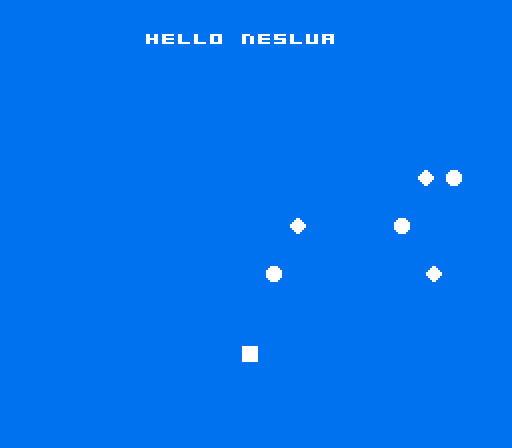

# neslua

[](https://www.npmjs.com/package/neslua)

**PICO-8-flavored Lua, ahead-of-time compiled to a real NES `.nes` ROM.** No
interpreter, no VM: your Lua becomes native 6502 machine code. Zero native tools,
either - the cc65 toolchain runs as bundled WebAssembly. neslua is the NES member
of the [luacretro](https://github.com/monteslu) console SDK family (GameTank, GBA,
Genesis, NES, C64), sharing one statically-typed Lua-to-C front-end.

## Your first game

A complete NES game - one `main.lua`. It opens a pixel-drawing canvas, paints a
smiley into it, and prints a greeting (see `examples/hello/main.lua`):

```lua
function _init()
  nes.canvas_at(6, 6, 13, 9)   -- a 48x48 pixel-drawing window, centered
  circfill(24, 24, 22, 1)      -- filled face
  circfill(15, 19, 4, 0)       -- left eye (cut out)
  circfill(33, 19, 4, 0)       -- right eye
  circfill(24, 27, 13, 0)      -- carve a grin...
  circfill(24, 21, 14, 1)      -- ...leaving a crescent smile
end

local ready = 0
function _draw()
  if (ready == 0) then
    cls(1)                              -- dark-blue backdrop (drawn once)
    print("hello from neslua", 60, 176, 7)
    ready = 1
  end
end
```

Build it and play it in a window:

```sh
npx neslua run examples/hello/main.lua
```

<p align="center">
  
</p>

Or build the cartridge - a byte-for-byte `.nes` that runs on any emulator or real
hardware:

```sh
npx neslua build examples/hello/main.lua -o hello.nes
```

That's the whole loop: write `main.lua`, `run` it, ship the `.nes`. (`npx neslua
c main.lua` prints the generated C, for debugging.)

## Why neslua

- **Real cartridges.** The output is a byte-for-byte `.nes` that runs on real
  hardware and every NES emulator - not a fantasy console.
- **The same Lua as the rest of the family.** PICO-8's 16.16 fixed-point number
  model, the `_init`/`_update`/`_draw` callback contract, the dialect
  (`+= -= *= /= \= %=`, `\` floor-division, `//` comments). Where the hardware
  has a wall, the compiler **fails loudly at compile time** with a fix-it.
- **Honest about the hardware.** The NES has no framebuffer, so neslua exposes
  three real surfaces (background tiles, sprites, a small pixel canvas) plus a
  blank-mode escape hatch - see [docs/DIFFERENCES.md](docs/DIFFERENCES.md). It
  does not pretend a 60fps full-screen `pset` canvas exists, because that is
  physically impossible on this machine.
- **8 KB of RAM for your game.** The standard cart is MMC1 with battery-backed
  PRG-RAM at `$6000`, so `array()`/`pool()` allocations have room (bare NROM
  leaves 512 bytes).

## The three-surface graphics model

| surface | verbs | what it is |
|---|---|---|
| **background** | `cls` `print` `map` `nes.tset` `nes.tpal` `nes.camera` | nametable tiles (32x28 text cells), written through the VRAM queue |
| **sprites** | `spr` | 8x8 hardware sprites (64 max, 8/scanline), staged in the shadow OAM |
| **pixel canvas** | `pset` `line` `rect` `rectfill` `circ` `circfill` | a small CHR-RAM window `nes.canvas(cw,ch)` the P8 drawing verbs paint |
| **blank mode** | *the full verb set* | `nes.blank(true)` - unlimited VRAM writes, screen dark (title cards) |

Resolution: the PPU renders **256 x 240**; NTSC output crops to **256 x 224**
visible. Coordinate space is 256 x 240. Full details in
[docs/DIFFERENCES.md](docs/DIFFERENCES.md).

## Examples

Each builds to a `.nes` and runs on the emulator (real captured frames below):

- [`hello`](examples/hello) - a smiley + centered text (the family hello).
- [`pad-square`](examples/pad-square) - move a sprite with the d-pad.
- [`mathcheck`](examples/mathcheck) - the 16.16 fixed-point conformance cart.
- [`canvas`](examples/canvas) - the pixel-canvas surface: a vector logo.

## Docs

- [CHEATSHEET.md](docs/CHEATSHEET.md) - the whole API on one page.
- [DIFFERENCES.md](docs/DIFFERENCES.md) - how the NES differs from PICO-8.
- [ASSETS.md](docs/ASSETS.md) - PNG -> CHR, tilemaps, color rules.

## Requirements

[Node.js](https://nodejs.org/) **24+**, and nothing else. `npm install` pulls in
`luacretro` (the shared front-end), `romdev-toolchain-cc65` (the cc65 toolchain
as WebAssembly), and `romdev-core-fceumm` (the emulator core for `neslua run`,
which also needs the optional `@kmamal/sdl` for the window). No native compiler
or emulator to install.

## License

MIT. No commercial game names in the shipped docs; the API is generic.
