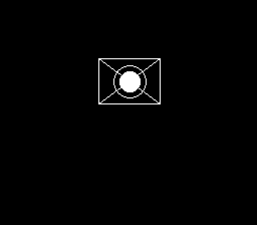

# canvas

The pixel-canvas surface (surface 3): a CHR-RAM window the P8 drawing verbs
paint into. This draws a bordered box with both diagonals, a filled center
circle, and a ring - a static "vector logo". It settles over about a second
(the NES VRAM queue drains ~16 writes per frame, so the canvas uploads a tile
per frame).

```lua
function _init()
  nes.canvas_at(8, 6, 12, 8)    -- an 8x6-tile canvas (64x48 px), centered
  rect(1, 1, 62, 46, 1)         -- border
  line(1, 1, 62, 46, 1)         -- diagonal
  line(62, 1, 1, 46, 1)         -- anti-diagonal
  circfill(32, 24, 10, 1)       -- center bloom
  circ(32, 24, 16, 1)           -- ring
end

function _draw()
  cls(0)                        -- backdrop only; the canvas is drawn in _init
end
```



*Real frame captured from the fceumm core (2x integer scale of native 256x224).*

```
neslua build main.lua -o canvas.nes
```
