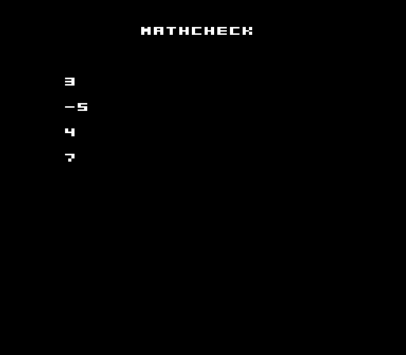

# mathcheck

The fixed-point conformance cart. It exercises the 16.16 fixed-point runtime
(PICO-8 semantics) and stores each result in a module global, so a test reads
them straight out of RAM. Every value is bit-exact against PICO-8:

| expression | expected |
|---|---|
| `1.5 + 2.25` | 3.75 |
| `1.5 * 2.0` | 3.0 |
| `3.0 / 2.0` | 1.5 |
| `-9 \ 2` (floor div) | -5 |
| `-9 % 2` (floored mod) | 1.0 |
| `sin(0.25)` (P8 screen-space) | -1.0 |
| `abs(-3.5)` | 3.5 |
| `min(4, 7)` / `max(4, 7)` | 4 / 7 |

```lua
function _init()
  r_add    = 1.5 + 2.25
  r_mul    = 1.5 * 2.0
  r_div    = 3.0 / 2.0
  r_flrdiv = -9 \ 2
  r_mod    = -9 % 2
  r_sqrt   = sqrt(2.0)
  r_sin    = sin(0.25)
  r_abs    = abs(-3.5)
  r_min    = min(4, 7)
  r_max    = max(4, 7)
end
```



*Real frame captured from the fceumm core (2x integer scale of native 256x224).
The 16.16 runtime is the gtlua 6502 asm/C ported near-verbatim; verified
bit-exact by reading the result globals out of RAM.*

```
neslua build main.lua -o mathcheck.nes
```
